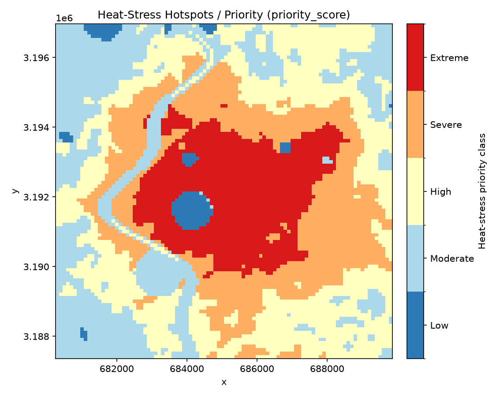
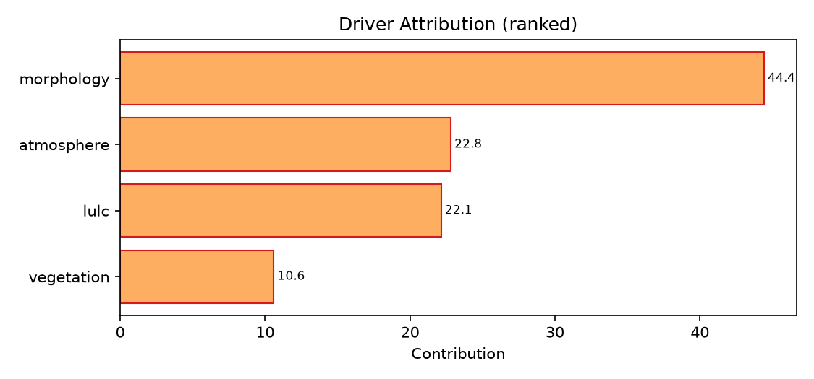
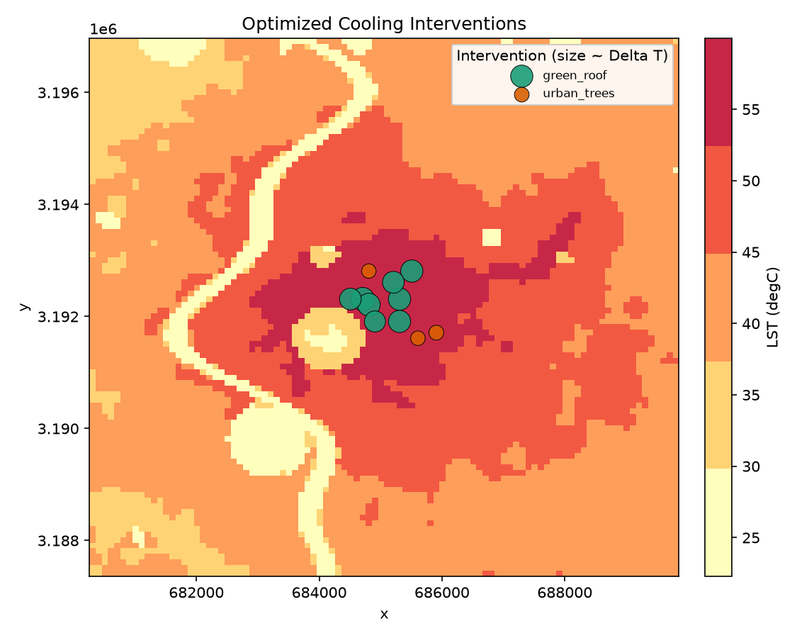

# Urban Heat Analysis Report — Delhi

*ISRO Bharatiya Antariksh Hackathon 2026 — Problem Statement 1*  
**Generated:** 2026-06-22 12:14 UTC  
**Mode:** `synthetic`  |  **Window:** 2024-03-01 -> 2024-05-31  |  **Resolution:** 100.0 m

This report assembles the four PS-1 deliverables: (1) heat-stress hotspot map + statistics, (2) ranked driver attribution, (3) a spatially-validated AI/ML model with physics-consistency, and (4) an optimized cooling-intervention strategy with per-site estimated temperature reduction.

---

## 1. Heat-Stress Hotspots

- **Hotspot area:** 9.8% of the AOI flagged as a surface heat hotspot (LST >= P90 AND Getis-Ord Gi* z >= 1.96).
- **Mean LST:** 42.9 degC (max 59.9 degC).
- **Surface UHI intensity (SUHII):** 10.31 degC vs the LCZ-D rural reference.

**Priority-class distribution (5-class legend):**

| Class | Range | Share |
|---|---|---|
| Low | 0-20 | 2.2% |
| Moderate | 20-40 | 25.0% |
| High | 40-60 | 30.2% |
| Severe | 60-80 | 24.6% |
| Extreme | 80-100 | 18.1% |

## 2. Driver Attribution (LULC / morphology / vegetation / atmosphere)

Ranked %-contribution of the four PS-1 driver families to LST, from mean(|SHAP|) on the trained model (cross-checked by variance partitioning where available). No driver claim is made without >=2 agreeing methods.

| Rank | Driver family | Contribution |
|---|---|---|
| 1 | morphology | 44.4% |
| 2 | atmosphere | 22.8% |
| 3 | lulc | 22.1% |
| 4 | vegetation | 10.6% |

**Leading driver family:** **morphology**.

## 3. Validated AI/ML Model

Headline validation uses **spatial block cross-validation** (not leaky random CV); the full metric panel is reported as mean across folds.

| Metric | Value |
|---|---|
| RMSE (degC) | 0.751 |
| MAE (degC) | 0.578 |
| Bias (degC) | -0.024 |
| ubRMSE (degC) | 0.744 |
| R^2 | 0.987 |
| NSE | 0.987 |
| Lin's CCC | 0.994 |
| KGE | 0.986 |

Literature anchor (Extra-Trees LST): R^2 ~= 0.908; RMSE ~= 0.745 degC.

**Physics-consistency checks:**

- SEB closure residual ~ 321.626 W/m^2 (diagnostic of temperature-dependent flux closure under default exchange coefficients; not driven to zero on the synthetic stack).

## 4. Optimized Cooling-Intervention Strategy

A lazy-greedy submodular optimizer ((1 - 1/e) ~= 0.63 guarantee) selects a ranked portfolio of typed, placed interventions under budget / area / equity (population x HVI) constraints. ΔT is the estimated **surface** temperature reduction per site.

| # | Type | Location (x, y) | Area (m^2) | Cost | Delta T (degC) |
|---|---|---|---|---|---|
| 1 | green_roof | 684708, 3192312 | 10,000 | 1,200,000 | 8.035 |
| 2 | green_roof | 685308, 3192312 | 10,000 | 1,200,000 | 7.254 |
| 3 | green_roof | 685308, 3191912 | 10,000 | 1,200,000 | 7.124 |
| 4 | green_roof | 685508, 3192812 | 10,000 | 1,200,000 | 7.182 |
| 5 | green_roof | 685208, 3192612 | 10,000 | 1,200,000 | 6.827 |
| 6 | green_roof | 684808, 3192212 | 10,000 | 1,200,000 | 7.581 |
| 7 | green_roof | 684908, 3191912 | 10,000 | 1,200,000 | 6.38 |
| 8 | green_roof | 684508, 3192312 | 10,000 | 1,200,000 | 6.76 |
| 9 | urban_trees | 685908, 3191712 | 10,000 | 120,000 | 2.614 |
| 10 | urban_trees | 684808, 3192812 | 10,000 | 120,000 | 2.419 |
| 11 | urban_trees | 685608, 3191612 | 10,000 | 120,000 | 2.451 |

**Portfolio totals:** **11** sites selected; city-wide mean cooling **0.03 degC**; population-heat-exposure reduction **0.4%**; total cost **9,960,000**.

## 5. Methods, Datasets & Robustness

The pipeline is backed by a **35-entry cross-verification matrix** (research/09) — every source both fills others' gaps and is itself verified by an independent source.
- 17 datasets + 18 analytical methods
- 18 active in this run
- 5 LST sensors, 4 LULC products, 4 footprint sources, 3 reanalyses

Honest-confidence layers present: 1 uncertainty + 0 agreement layers (every deliverable map ships with a paired uncertainty map).
Mean LST 1-sigma fusion uncertainty: 0.915 degC.

> Robustness: 35 cross-verifying entries (17 datasets + 18 methods) from the research/09 matrix; 18 active in this run (>=30 target MET). 1 uncertainty + 0 agreement layers present; 63 canonical driver layers populated.

---

*Generated by `urbanheat` (physics-informed, multi-satellite geospatial AI/ML for urban heat). Synthetic-mode figures are illustrative of the pipeline, not a substitute for calibrated data.*